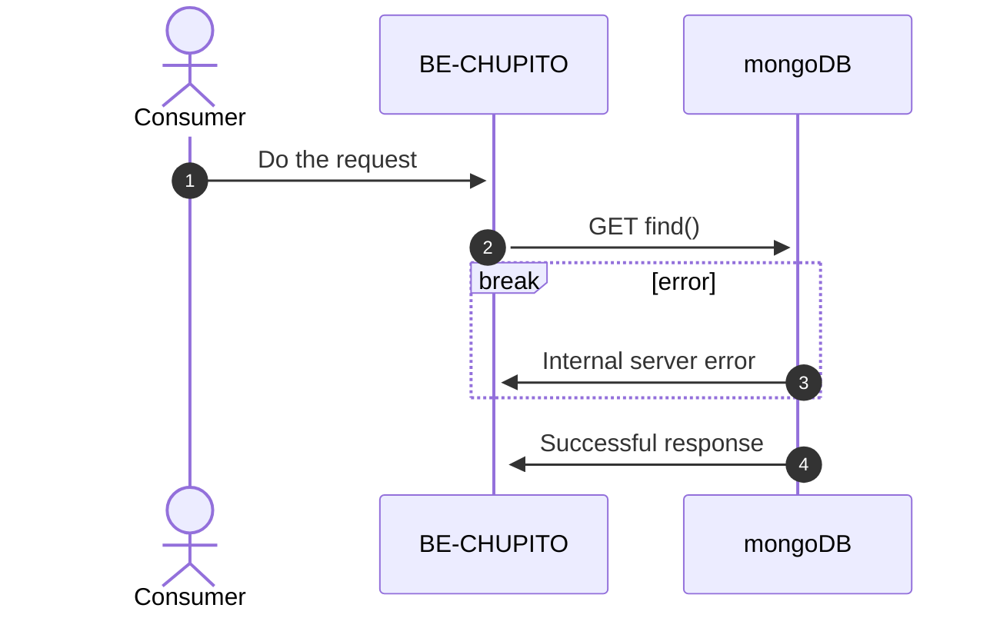
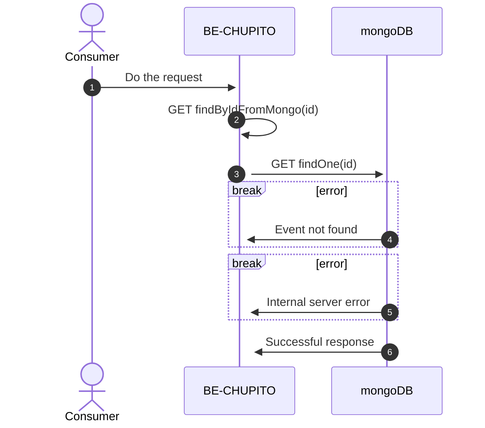
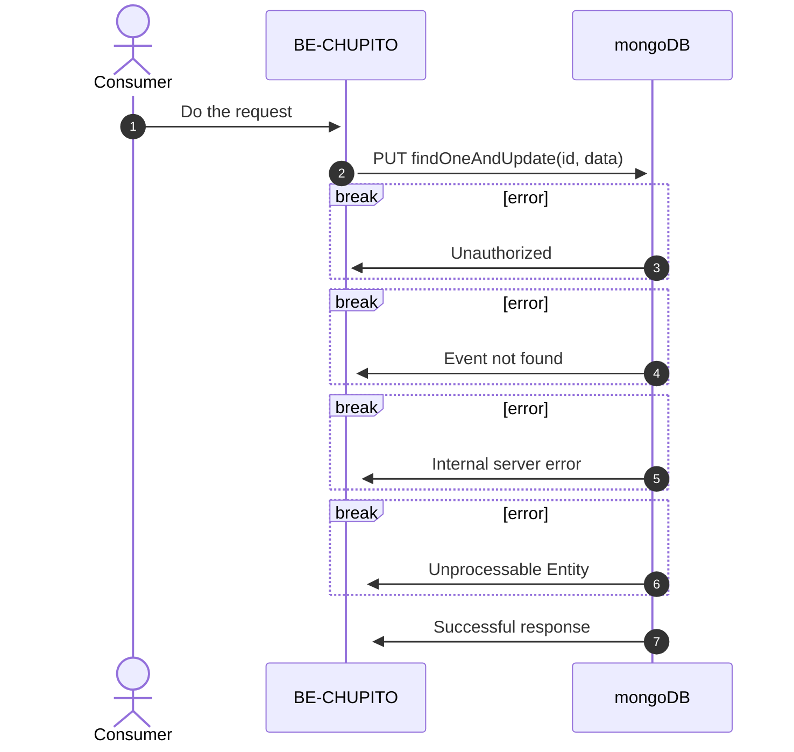
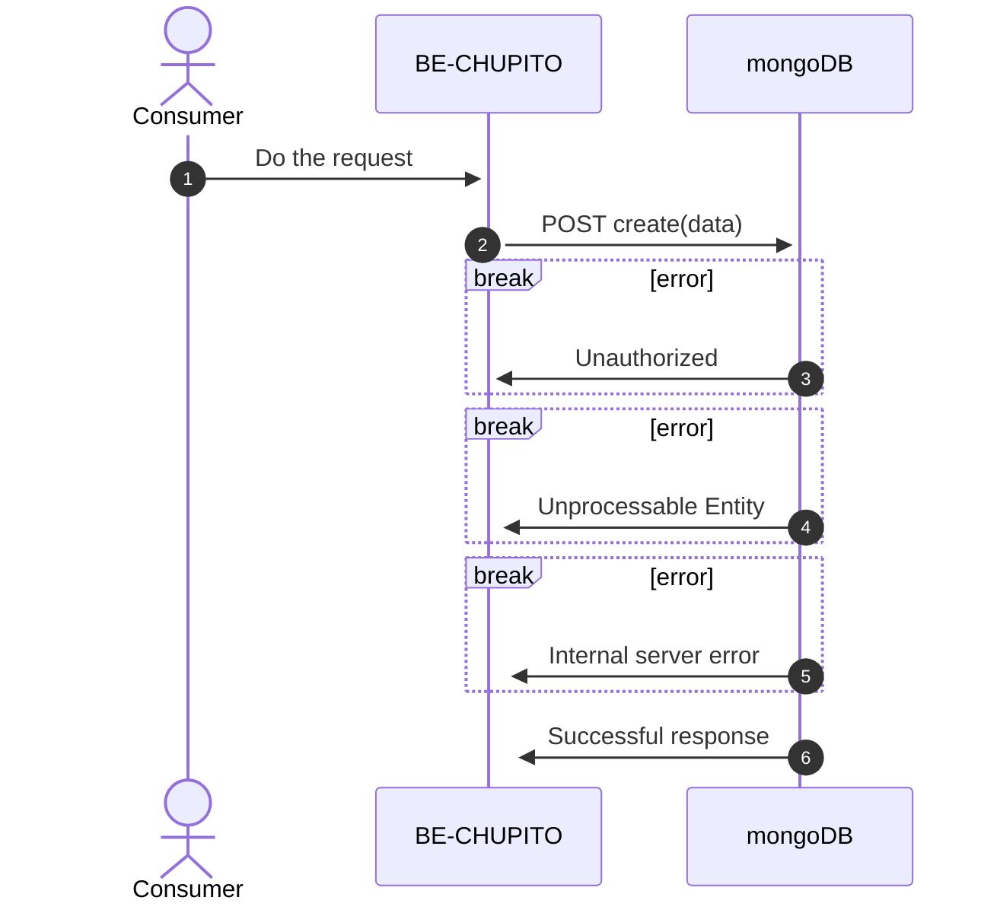

import NumberBullet from '@site/src/components/NumberBullet';

# API eventos

## API: listar eventos regitrados

Permitirá al usuario obtener los eventos que han sido regitrados

<NumberBullet number='1'> Se hace la petición a mongo DB para obtener los eventos registrados</NumberBullet>

- El servicios hace validaciones de formato y valores aceptados en el request

<NumberBullet number='2'> Si existe algún error en el endpoint, retornará error 500 </NumberBullet>
<NumberBullet number='3'>Restornará 200 si se obtuvo la lista de eventos con éxito </NumberBullet>

- Si exite data, retornará una lista con los eventos registrados, de lo contrario retornará una lista vacía

## API: Obtener evento por Id

Permitirá al usuario obtener el evento al que le pertence el Id que es pasado por paramentro

<NumberBullet number='1'> La aplicación realizará el llamado al método para obtener el evento de acuerdo a un parametro: </NumberBullet>

- **_id_** : id que le pertenece al evento

<NumberBullet number='2'> MongoDB recibe la petición </NumberBullet>
<NumberBullet number='3'> Si el evento no existe, retornará error 404</NumberBullet>
<NumberBullet number='3'> Si existe error en el endpoint, retornará error 500</NumberBullet>
<NumberBullet number='4'>Se retornará 200 si encuentra el evento con el Id indicado</NumberBullet>

- Retorna el evento con el Id que se paso por parámetro

## API: Actualizar evento

Permitirá al usuario actualizar el evento al que le pertenece el Id enviado por parametro

<NumberBullet number='1'> MongoDB recibirá la petición con dos parametro: </NumberBullet>

- **_id_** : id que le pertenece al evento
- **_data_** : data con la que se actualiza el evento

<NumberBullet number='2'> Si el usuario no esta logueado como admin, retornará error 401 </NumberBullet>
<NumberBullet number='3'> Si el evento no exist, retornará error 404</NumberBullet>
<NumberBullet number='4'>Si existe un error en el endpoint, restornará 500</NumberBullet>
<NumberBullet number='5'> Si algún atributo esta mal escrito, retornará error 422</NumberBullet>
<NumberBullet number='6'>Se retornará 200 si se actualiza el evento con el Id indicado</NumberBullet>

- Retornará el evento con la información actualizada

## API: Crear evento

Permitirá al usuario crear un evento

<NumberBullet number='1'> Se realizará la petición con un parametro: </NumberBullet>

- **_data_** : data para el evento a crear

<NumberBullet number='2'> Si el usuario no esta logueado como admin, retornará error 401 </NumberBullet>
<NumberBullet number='3'> Si algún atributo esta mal escrito, retornará error 422</NumberBullet>
<NumberBullet number='4'>Si existe un error en el endpoint, restornará 500</NumberBullet>
<NumberBullet number='5'>Se retornará 201 si el evento fue creado correctamente</NumberBullet>

- Retornará el evento creado
