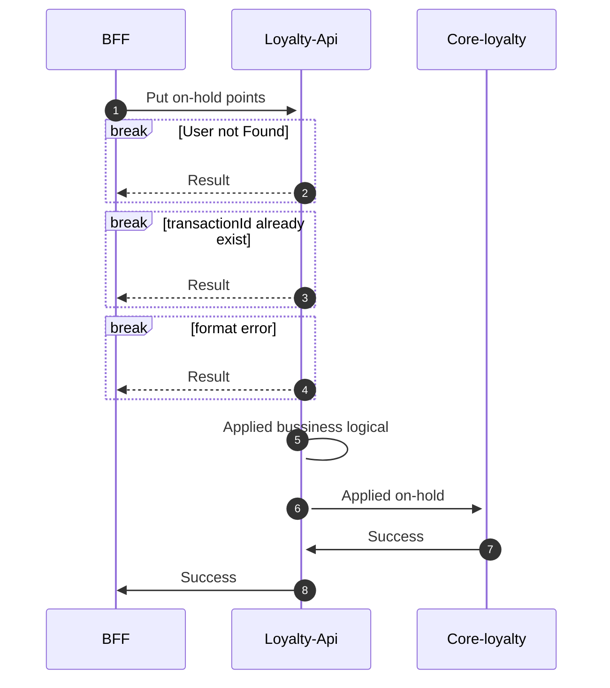
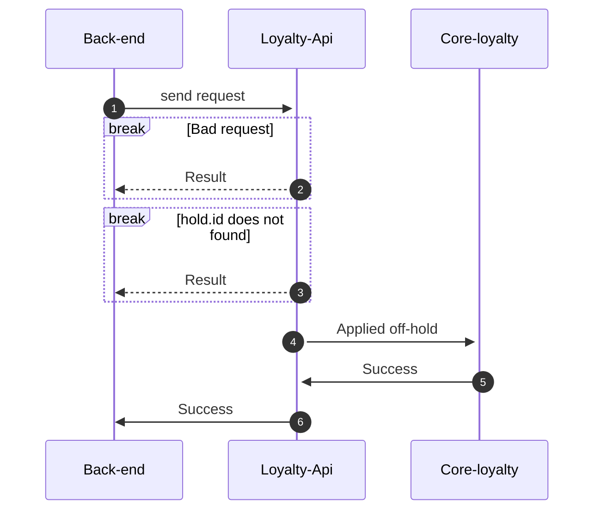

import NumberBullet from '@site/src/components/NumberBullet';

# Programa de redención de puntos

## ¿Qué es redención de puntos?
La redención de puntos o canje es una forma de recompensa que se otorga a los miembros de un programa de lealtad por su fidelidad y compromiso con nuestra empresa de alquiler de autos.
Una vez que los miembros han acumulado suficientes puntos, pueden canjearlos por el alquiler gratuito de autos o descuentos. 

El valor de los puntos de canje puede variar según el plan: Basic, Premium o Gold.

## API: Reservar puntos

Se ha desarrollado una API denominada "reservar puntos", la cual permite la reserva de puntos que se asocian a la reserva de un auto y que posteriormente podrán ser canjeados. [APIs Reservar puntos link](#./api-catalog/docs/post-onhold-redemption)

   <NumberBullet number='1'> Back-end recibirá la solicitud para reservar puntos del cliente asociadio a una transación de una reserva </NumberBullet> 
   * el servicios realizara validaciones de formato y valores aceptados en el request
   <NumberBullet number='2'> Si el customer.id del request no es válido, retornará error 404 </NumberBullet> 
   <NumberBullet number='3'> Si el transactionId ya fue procesado anteriormente, retornará error 400</NumberBullet> 
   <NumberBullet number='4'> Si onHold.TotalCashes menor o igual a onHold.TotalCashWithPoints, retornará error 400</NumberBullet> 
   <NumberBullet number='5'> Loyalty-Api aplicará la logica de selecion de plan antes de enviar solicitud al core-loyalty </NumberBullet>
   <NumberBullet number='6'> Loyalty-Api aplicará la solicitud de puntos de canje a Core-loyalty </NumberBullet>
   <NumberBullet number='7'> Core-loyalty retornará reserva con éxito a Loyalty-Api </NumberBullet>
   <NumberBullet number='8'> Loyalty-Api retornará reserva con éxito a Back-end </NumberBullet>
   

* Retornará el `id` assignado para esta reserva de puntos

## API: Redención de puntos

El API de redención de puntos hace efectiva el canje de puntos o hace un rollback de la transación dependiendo de `applyRedemption` recibido en el request. [API aplicar redemción link](#./api-catalog/docs/postoffhold-redemption)

   <NumberBullet number='1'> Back-end recibirá la solicitud de redención con dos parametros: </NumberBullet> 

- ***id*** : id asignado a la reserva de los puntos
- ***applyRedemption*** : true cuando se quiere aplicar la redención. False cuando no se quiere aplicar la redención. 

:::warning
Tenga en cuenta que si decide dar rollback a la reserva, se aplicara una penalización al cliente según la politica asignada
:::
   
   <NumberBullet number='2'> Si el formato del request no es válido, retornará error 400 </NumberBullet> 
   <NumberBullet number='3'> Si el hold.id del request no se encuentra o no es válido, retornará error 404</NumberBullet> 
   <NumberBullet number='5'> Loyalty-Api aplicará la redención de puntos de canje a Core-loyalty </NumberBullet>

*   Cuando se aplica la derención, se descongelarán los puntos reservados y se descontararán del blaance general del cliente
*   Cuando no se aplica la redención, se retornan los puntos congenlados al balance general del cliente resptando los puntos por penalidad según la politica.  

   <NumberBullet number='6'> Core-loyalty retornará rendención con éxito a Loyalty-Api </NumberBullet>
   <NumberBullet number='7'> Loyalty-Api retornará redención con éxito a Back-end </NumberBullet>