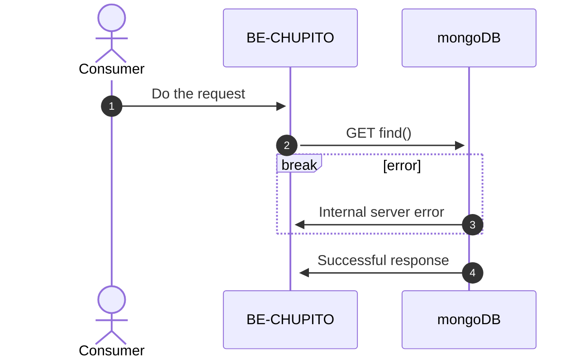
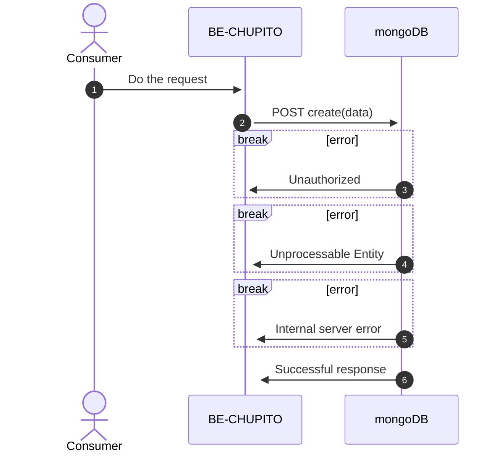

import NumberBullet from '@site/src/components/NumberBullet';

# API usuarios

## API: Listar usuarios regitrados

Permitirá al usuario obtener todos los usuarios que estan regitrados (se necesita token de autenticación para realizar esta petición)

<NumberBullet number='1'> Se hace la petición a mongo DB para obtener los usuarios resgistrados</NumberBullet>

- El servicios hace validaciones de formato y valores aceptados en el request

<NumberBullet number='2'> Si existe algún error en el endpoint, retornará error 500 </NumberBullet>
<NumberBullet number='3'>Restornará 200 si se obtuvo la lista de usuarios con éxito </NumberBullet>

- Si exite data, retornará una lista con los usuarios registrados, de lo contrario retornará una lista vacía

## API: Crear usuario

Permitirá al usuario crear un usuario

<NumberBullet number='1'> Se realizará la petición con un parametro: </NumberBullet>

- **_data_** : data para el usuario a crear

<NumberBullet number='2'> Si el usuario no esta logueado como admin, retornará error 401 </NumberBullet>
<NumberBullet number='3'> Si algún atributo esta mal escrito, retornará error 422</NumberBullet>
<NumberBullet number='4'>Si existe un error en el endpoint, restornará 500</NumberBullet>
<NumberBullet number='5'>Se retornará 201 si el usario fue creado correctamente</NumberBullet>

- Retornará el usuario creado
