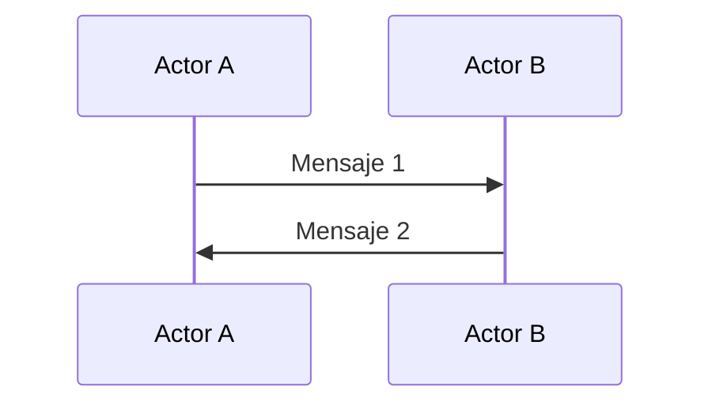
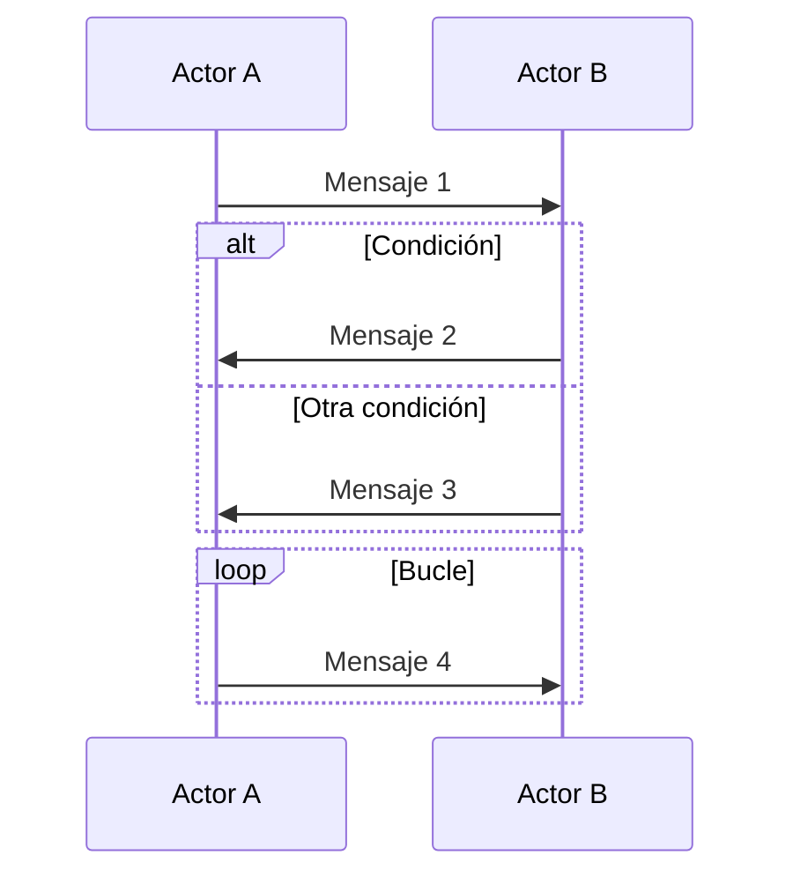
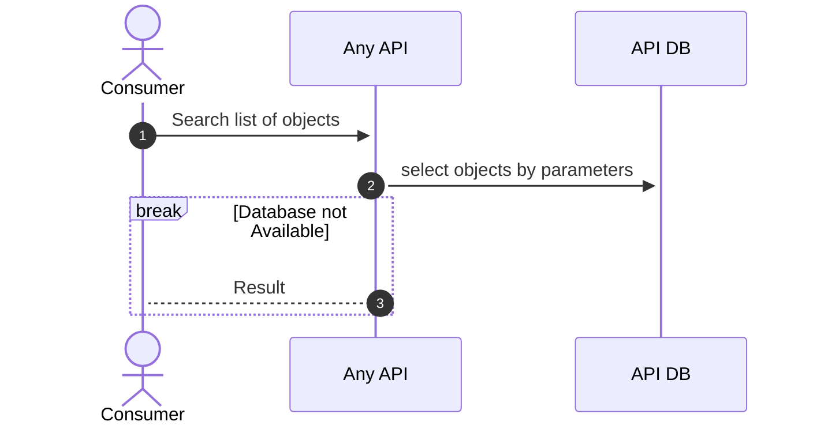

import NumberBullet from '@site/src/components/NumberBullet';

# ¿Qué es Mermaid?

Mermaid es una herramienta de generación de diagramas que utiliza texto simple y legible para crear diagramas de flujo, diagramas de secuencia, diagramas de Gantt y otros tipos de diagramas. Permite representar visualmente la estructura y el flujo de un proceso o sistema.

Sintaxis básica de Mermaid
La sintaxis de Mermaid es sencilla y se basa en el uso de texto plano. A continuación se presentan algunos ejemplos de la sintaxis básica utilizada para crear diagramas de secuencia:

Diagrama de secuencia básico


En este ejemplo, se definen dos participantes (Actores A y B) y se muestra la secuencia de intercambio de mensajes entre ellos.

Para conseguir esto, solo tenemos que usar el siguiente codigo (presta especial atención a las triples comillas inversas al principio y final del código de Mermaid).

```
    ```mermaid
    sequenceDiagram
        participant A as Actor A
        participant B as Actor B
        A->>B: Mensaje 1
        B->>A: Mensaje 2
    ```
```

Diagrama de secuencia con condiciones y bucles

En este ejemplo, se muestra cómo se pueden agregar condiciones y bucles a un diagrama de secuencia. El bloque alt se utiliza para representar una condición, el bloque else se utiliza para representar otra condición y el bloque loop se utiliza para representar un bucle.

Entonces el código sería el siguiente:

```
    ```mermaid
    sequenceDiagram
        participant A as Actor A
        participant B as Actor B
        A->>B: Mensaje 1
        alt Condición
            B->>A: Mensaje 2
        else Otra condición
            B->>A: Mensaje 3
        end
        loop Bucle
            A->>B: Mensaje 4
        end
    ```
```


Ahora vamos a ir parte por parte del código:

```
   ```mermaid
```

Con esta línea indicamos que estamos construyendo un diagrama con Mermaid. Debemos asegurarnos que no dejamos espacio entre las comillas y el texto

```
   sequenceDiagram
    autonumber
```

Estas dos líneas indican que el diagrama a mostrar sera uno de secuencia y que los pasos se numerarán de forma automática.

```
    actor CONSUMER as Consumer
        participant A as Actor A
        participant B as Actor B
```

En esta sección se definen los participantes y los actores involucrados en el diagrama, al utilizar "as" especificamos el nombre que aparecerá en el diagrama, lo cual es útil para usar alias para los participantes.

```
    CONSUMER->>+Actor A: Search list of objects
```

Aqui se esta representando una interacción donde se hace una solicitud a un participante, la dirección de la comunicación se determina por el tipo de operador usado

```
    ->>+
```

Para los request

```
    -->>-
```
Para las respuestas

en caso de una respuesta producto de un error podemos usar

```
    -->+
```

por ejemplo podriamos ver este flujo con error


Ahora que ya vimos como generar el diagrama, solo queda colocar la explicación de cada uno de los pasos del diagrama. Para preservar el estilo necesitamos importar una librería para enumerar los pasos, para esto insertamos en el comienzo del docuemtno 

```
    import NumberBullet from '@site/src/components/NumberBullet';
```
 y para cada bullet usamos

 ```
    <NumberBullet number='1'> Se recibe un parámetro para realizar una consulta </NumberBullet> 
    <NumberBullet number='2'> Se consulta en base de datos </NumberBullet> 
    <NumberBullet number='3'> Se obtiene la respuesta de base de datos </NumberBullet> 
    <NumberBullet number='4'> El resultado se retorna como una lista ordenada</NumberBullet> 

```

para mas información puedes referirte al sitio oficial de Mermaid

https://mermaid.js.org/syntax/sequenceDiagram.html
